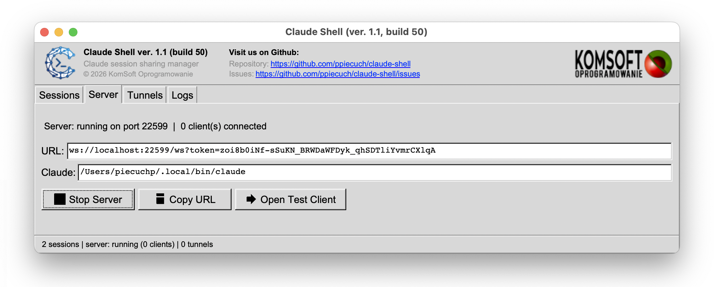

# Claude Shell

[](https://www.paypal.com/donate?business=6QXS8MBPKBTTN&item_name=Claude+Shell+app.&currency_code=USD)

A macOS management console for sharing your local **Claude Code** CLI sessions
with a remote browser through a tunnel provider.



## What it does

Claude Shell discovers Claude Code sessions running on your Mac, exposes them
through a local WebSocket proxy with a per-session auth token, and orchestrates
a public tunnel (**ngrok**, **Microsoft Dev Tunnels**, or **Cloudflare Tunnel**)
so a teammate — or you on another machine — can drive the session from any
browser.

The desktop app itself is a setup-and-control panel; all prompts, tool
approvals, and streaming responses happen in the embedded web client connected
through the tunnel.

## Install

Download the latest signed and notarized DMG from
[Releases](https://github.com/ppiecuch/claude-shell/releases), drag
**Claude Shell.app** into `/Applications`, and launch it. Gatekeeper opens
it with no warnings.

## Build from source

Requirements: macOS 13+, Xcode command-line tools, CMake 3.20+, and a
prebuilt static FLTK 1.5 (libraries + headers).

Point CMake at your FLTK install with `-DFLTK_DIR=/path/to/fltk` (or
the `FLTK_DIR` env var). The directory must contain `lib/libfltk.a`,
`lib/libfltk_images.a`, `lib/libfltk_png.a`, `lib/libfltk_jpeg.a`,
`lib/libfltk_z.a`, and `include/FL/`.

```bash
cmake -B build -DFLTK_DIR=/path/to/fltk
cmake --build build -j8
# → build/ClaudeShell.app
```

### Distributable build (Developer ID + notarization)

One-time setup of an Apple notary keychain profile:

```bash
xcrun notarytool store-credentials claudeshell-notary \
    --apple-id YOU@example.com \
    --team-id YOUR_TEAM_ID \
    --password APP_SPECIFIC_PASSWORD
```

Then:

```bash
./_scripts/archive.sh                        # signed .app only
./_scripts/archive.sh + --notarize           # bump build, archive, notarize
./_scripts/archive.sh + --notarize --dmg     # also produce a notarized .dmg
```

Outputs land in `dist/`.

## Links

- Repository: <https://github.com/ppiecuch/claude-shell>
- Report an issue: <https://github.com/ppiecuch/claude-shell/issues>

## License

Copyright © 2025–2026 KomSoft Oprogramowanie. All rights reserved.

## Support

If you find this useful, please consider supporting development:

[](https://www.paypal.com/donate?business=6QXS8MBPKBTTN&item_name=Claude+Shell+app.&currency_code=USD)
